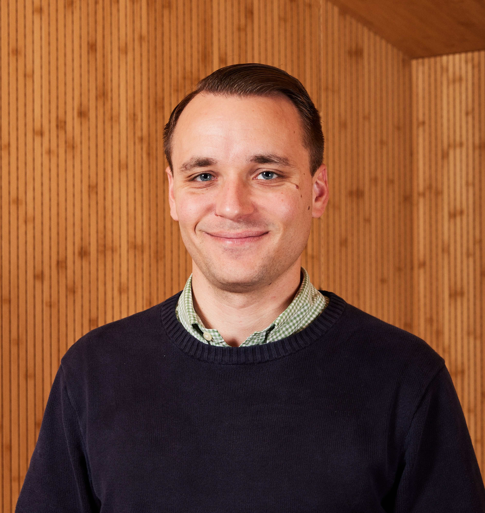

  <b>Update:</b> I’ve looking for a post-PhD job!
  If your team needs an engineer skilled in OS internals, compiler instrumentation, hardware/software interplay, and advanced systems security, please <a href="mailto:bjohannesmeyer@gmail.com">get in touch</a>!

Hi, I'm Brian! I’m a PhD candidate at [VU Amsterdam](https://vu.nl/en), fascinated by all things systems security. I enjoy discovering and mitigating software weaknesses before attackers can exploit them.

---

## Contact

* Email: [bjohannesmeyer@gmail.com](mailto:bjohannesmeyer@gmail.com)
* Social: [GitHub](https://github.com/bjohannesmeyer/), [Google Scholar](https://scholar.google.com/citations?user=hveLyDgAAAAJ), [LinkedIn](https://www.linkedin.com/in/bjohannesmeyer), [Twitter](https://twitter.com/bjohannesmeyer)

## Research Interests

I build tools that automatically identify vulnerabilities and generate exploits.
I’m especially into systems security, operating systems, and program analysis—basically, finding ways to break (and then fix) software in creative ways.
